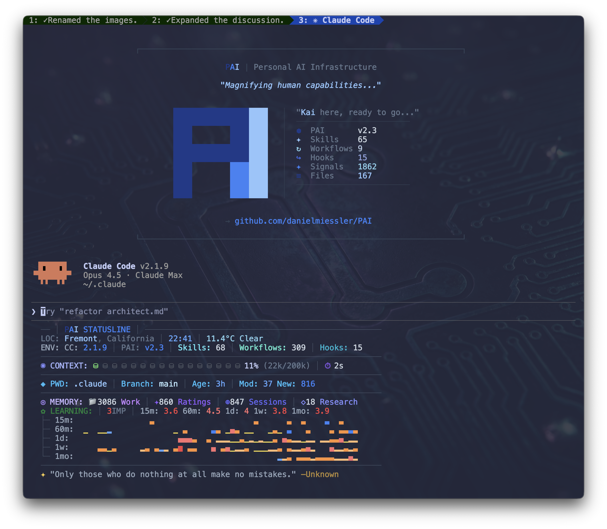
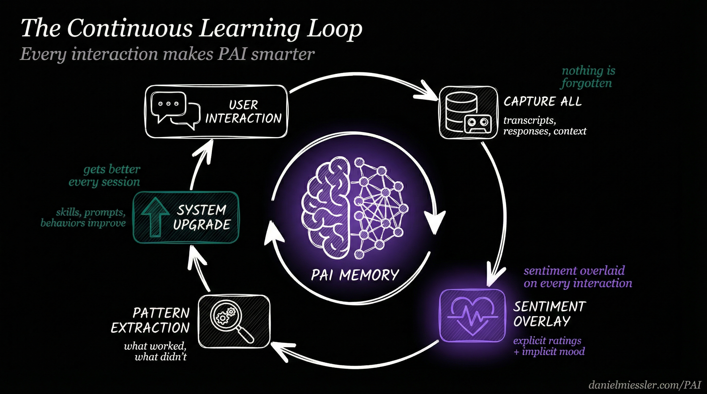
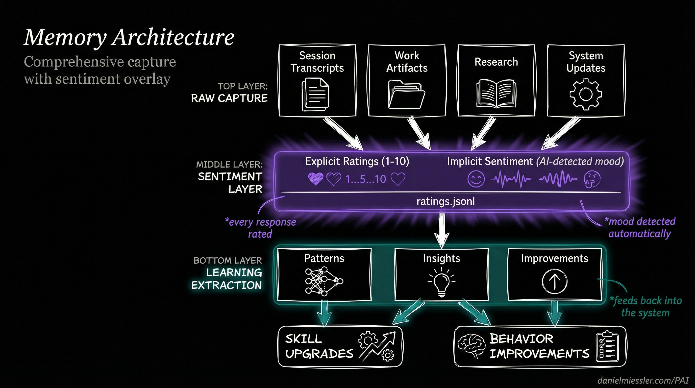
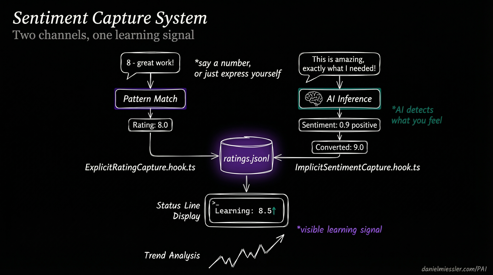

<div align="center">



<br><br>


# PAI v2.3.0 — Full Releases Return

**Complete .claude directory with continuous learning built in**

[](https://github.com/danielmiessler/PAI/releases/tag/v2.3.0)
[](skills/)
[](agents/)
[](hooks/)

</div>

---

## The Core Innovation: Continuous Learning

Most AI assistants forget everything after each session. They start fresh every time, making the same mistakes, missing the same context, unable to improve from feedback.

**PAI is different.** Every interaction teaches the system. Every rating, every expression of satisfaction or frustration, every completed task—all captured, analyzed, and fed back into the system. PAI doesn't just help you; it learns *how* to help you better.

<div align="center">



*Every interaction makes PAI smarter through capture, sentiment analysis, pattern extraction, and system upgrades*

</div>

### How It Works

1. **Capture Everything** — Every session is recorded: transcripts, responses, work artifacts, research. Nothing is lost.

2. **Overlay Sentiment** — On top of that raw capture, PAI overlays your emotional signal. Did you rate the response? Express satisfaction? Show frustration? All captured.

3. **Extract Patterns** — What worked? What didn't? The system identifies patterns across sessions, skills, and contexts.

4. **Upgrade the System** — Insights feed back into skills, prompts, and behaviors. The system literally improves itself.

This isn't theoretical—it's implemented in production hooks that run on every message.

---

## Comprehensive Memory: Everything Captured

PAI's memory system captures the complete history of your interactions, organized for learning.

<div align="center">



*Layered architecture: raw capture on top, sentiment overlay in the middle, learning extraction below*

</div>

### Memory Structure

```
MEMORY/
├── SESSIONS/           # Complete session transcripts
│   └── *.json          # Every conversation preserved
│
├── SIGNALS/            # The sentiment layer
│   └── ratings.jsonl   # Explicit + implicit ratings
│
├── LEARNINGS/          # Extracted insights
│   └── *.md            # Patterns that work
│
├── RESEARCH/           # Accumulated knowledge
│   └── */              # Topic-organized artifacts
│
└── PAISYSTEMUPDATES/   # System evolution
    └── *.md            # How PAI improves
```

### What Gets Captured

| Layer | Content | Purpose |
|-------|---------|---------|
| **Raw Capture** | Session transcripts, work artifacts, research, code | Complete history |
| **Sentiment Overlay** | Explicit ratings, implicit mood, satisfaction signals | Learning signal |
| **Pattern Extraction** | What worked, what failed, behavioral patterns | System improvement |
| **Learning Output** | Updated skills, refined prompts, new behaviors | Continuous upgrade |

---

## Sentiment Capture: Two Channels, One Signal

PAI captures your satisfaction through two complementary channels—you can rate explicitly, or the system detects how you feel automatically.

<div align="center">



*Explicit ratings and AI-detected sentiment merge into a unified learning signal*

</div>

### Explicit Rating Capture

Say a number, and PAI captures it:

```
User: "8 - great work on that refactor"
      ↓
ExplicitRatingCapture.hook.ts detects pattern
      ↓
Rating: 8.0 → ratings.jsonl
```

**Patterns recognized:**
- `"8"` (just the number)
- `"8 - good job"`
- `"that was a 9"`
- `"I'd give that a 7"`

### Implicit Sentiment Capture

Don't want to rate? Just express yourself naturally:

```
User: "This is amazing, exactly what I needed!"
      ↓
ImplicitSentimentCapture.hook.ts runs AI inference
      ↓
Sentiment: 0.9 positive → Converted: 9.0 → ratings.jsonl
```

**What triggers sentiment detection:**
- Expressions of satisfaction: "perfect", "exactly right", "love it"
- Expressions of frustration: "that's wrong", "not what I asked", "try again"
- Task completion language: "done", "finished", "that works"
- Emotional indicators: exclamation marks, capitalization, word choice

### The Unified Signal

Both channels merge into `ratings.jsonl`—a single source of truth for how well PAI is serving you:

```jsonl
{"timestamp":"2026-01-15T22:30:00Z","rating":8.0,"type":"explicit","context":"refactor task"}
{"timestamp":"2026-01-15T22:35:00Z","rating":9.0,"type":"implicit","sentiment":0.9,"context":"bug fix"}
```

This signal appears in real-time on your status line:

```
Good evening, Daniel │ Wielding opus │ Learning: 8.5↑ │ Context: 42%
```

The `↑` indicates your satisfaction is trending up. The system is learning.

---

## The Learning Hooks

PAI's continuous learning is implemented through 14 TypeScript hooks that run at lifecycle events:

### Capture Hooks (What Goes In)

| Hook | Event | What It Captures |
|------|-------|------------------|
| `AgentOutputCapture` | SubagentStop | Subagent results and outcomes |
| `AutoWorkCreation` | UserPromptSubmit | Work context and session state |
| `SessionSummary` | SessionEnd | Complete session wrap-up |

### Sentiment Hooks (The Overlay)

| Hook | Event | What It Detects |
|------|-------|-----------------|
| `ExplicitRatingCapture` | UserPromptSubmit | Numeric ratings in messages |
| `ImplicitSentimentCapture` | UserPromptSubmit | Emotional tone via AI inference |

### Learning Hooks (What Comes Out)

| Hook | Event | What It Extracts |
|------|-------|------------------|
| `WorkCompletionLearning` | SessionEnd | Insights from completed work |

### The Complete Hook Architecture

```
┌─────────────────────────────────────────────────────────────────────┐
│                     THE LEARNING PIPELINE                           │
├─────────────────────────────────────────────────────────────────────┤
│                                                                     │
│  SessionStart ──► LoadContext ──► Previous learnings injected       │
│                                                                     │
│  UserPromptSubmit ──┬──► AutoWorkCreation ──► Context captured      │
│                     ├──► ExplicitRatingCapture ──► "8" detected     │
│                     ├──► ImplicitSentimentCapture ──► mood inferred │
│                     └──► UpdateTabTitle ──► Learning signal shown   │
│                                                                     │
│  SubagentStop ──► AgentOutputCapture ──► Agent work recorded        │
│                                                                     │
│  SessionEnd ──┬──► WorkCompletionLearning ──► Patterns extracted    │
│               └──► SessionSummary ──► Session archived              │
│                                                                     │
└─────────────────────────────────────────────────────────────────────┘
```

---

## Status Line: Learning Made Visible

PAI's responsive status line shows your learning signal in real-time, adapting to terminal width:

### 4-Mode Responsive Display

| Mode | Width | Display |
|------|-------|---------|
| `nano` | <35 cols | `8.5↑` |
| `micro` | 35-54 | `Learning: 8.5↑` |
| `mini` | 55-79 | `Learning: 8.5↑ │ Context: 42%` |
| `normal` | 80+ | Full display with sparklines and trends |

### What the Learning Signal Shows

```
Learning: 8.5↑
         │  │
         │  └── Trend direction (↑ improving, ↓ declining, → stable)
         │
         └───── Rolling average of recent ratings
```

This isn't vanity metrics—it's the system showing you that it's learning from your feedback in real-time.

---

## Full Release: Everything Included

v2.3 brings back **complete, functional releases**. Copy the `.claude/` directory and start immediately.

### What's Inside

```
.claude/
├── settings.json           # Pre-configured, works immediately
├── install.ts              # Interactive setup wizard
├── statusline-command.sh   # Responsive 4-mode status line
│
├── hooks/                  # 14 learning hooks
│   ├── ExplicitRatingCapture.hook.ts
│   ├── ImplicitSentimentCapture.hook.ts
│   ├── WorkCompletionLearning.hook.ts
│   ├── AgentOutputCapture.hook.ts
│   └── ... (10 more)
│
├── MEMORY/                 # Comprehensive capture system
│   ├── SESSIONS/           # Session transcripts
│   ├── SIGNALS/            # Sentiment layer (ratings.jsonl)
│   ├── LEARNINGS/          # Extracted insights
│   └── RESEARCH/           # Knowledge artifacts
│
├── skills/                 # 20 production skills
├── agents/                 # 11 named agents
└── Observability/          # Real-time monitoring dashboard
```

### Quick Start

```bash
# 1. Backup existing installation
mv ~/.claude ~/.claude-backup

# 2. Copy the release
cp -r .claude ~/

# 3. Run setup wizard
cd ~/.claude && bun run install.ts

# 4. Start PAI
claude
```

---

## 20 Skills, 11 Agents

### Skills

Production-tested capabilities extracted from active PAI systems:

| Category | Skills |
|----------|--------|
| **Core** | CORE, THEALGORITHM, System, PAIUpgrade |
| **Research** | Research, OSINT, PrivateInvestigator, AnnualReports |
| **Creative** | Art, Prompting, Council, RedTeam |
| **Development** | Browser, CreateCLI, CreateSkill, Agents |
| **Specialized** | Telos, FirstPrinciples, BrightData, Recon |

### Named Agents

Persistent personalities for specialized work:

| Agent | Role |
|-------|------|
| **Architect** | System design, PhD-level distributed systems |
| **Engineer** | Principal engineer patterns, TDD |
| **Artist** | Visual content, prompt engineering |
| **Designer** | UX/UI, accessibility, shadcn/ui |
| **QATester** | Browser automation, verification |
| **Pentester** | Security testing, ethical boundaries |
| **Intern** | High-agency generalist, 176 IQ |
| **GeminiResearcher** | Multi-perspective, parallel investigations |
| **GrokResearcher** | Contrarian, fact-based analysis |
| **CodexResearcher** | Technical archaeology, curiosity-driven |
| **ClaudeResearcher** | Academic, scholarly synthesis |

---

## Security: Learning Without Leaking

Multi-layer defense ensures learning data stays private:

| Layer | Protection |
|-------|------------|
| **Permissions** | Tool-level allow/deny/ask in settings.json |
| **SecurityValidator** | PreToolUse command filtering |
| **patterns.yaml** | Pattern-based security rules |
| **USER/** | Personal content never shared |

All security decisions logged to `MEMORY/SECURITY/security-events.jsonl` for audit.

---

## The Philosophy: Euphoric Surprise

PAI pursues a singular goal—creating *Euphoric Surprise* in how it executes every task. Not just completion, but results so thorough and thoughtful that you're genuinely surprised and delighted.

The continuous learning system makes this possible. Every time you're delighted (rating captured), PAI learns what works. Every time you're frustrated (sentiment detected), PAI learns what to avoid. Over time, the system becomes increasingly tuned to your preferences.

**This is what enterprise AI teams build internally. Now it's open-source.**

---

## What's New in v2.3

| Feature | Description |
|---------|-------------|
| **Full Releases Return** | Complete `.claude/` directory, copy and start |
| **Sentiment Capture** | Explicit ratings + AI-detected mood |
| **Comprehensive Memory** | Every session, artifact, and signal captured |
| **Learning Status Line** | Real-time visibility into learning signal |
| **Pattern Extraction** | WorkCompletionLearning extracts insights |
| **Euphoric Surprise** | North star philosophy embedded throughout |

---

## Resources

- **GitHub**: [github.com/danielmiessler/PAI](https://github.com/danielmiessler/PAI)
- **Video**: [PAI Overview](https://youtu.be/Le0DLrn7ta0)
- **Philosophy**: [The Real Internet of Things](https://danielmiessler.com/blog/real-internet-of-things)
- **Maturity Model**: [Personal AI Maturity Model](https://danielmiessler.com/blog/personal-ai-maturity-model)

---

<div align="center">

**PAI v2.3.0** — AI that learns from every interaction.

*Everyone deserves AI that gets better at helping them over time.*

</div>
