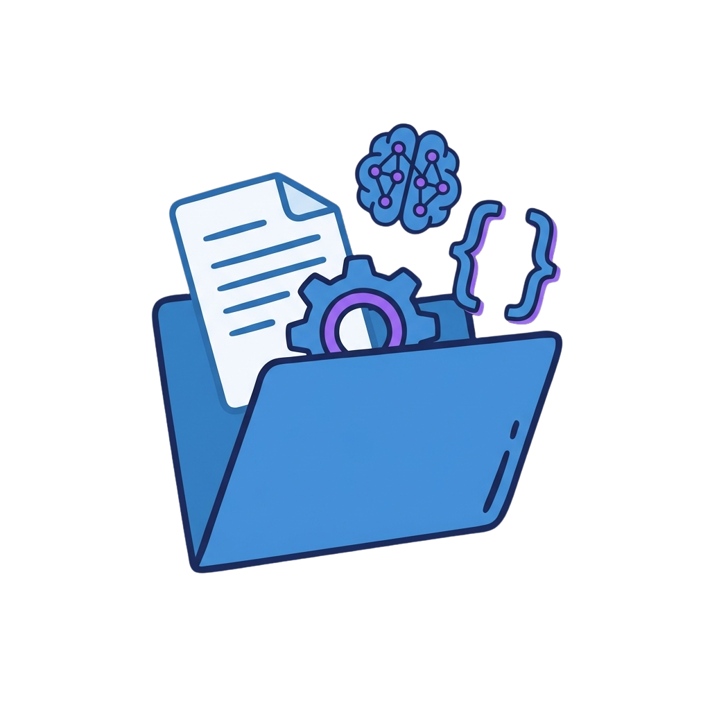

<div align="center">



# PAI v2.4.0 — The Algorithm

**Our first attempt at a general problem solver built into PAI to pursue Euphoric Surprise**

[](https://github.com/danielmiessler/PAI/releases/tag/v2.4.0)
[](skills/)
[](hooks/)
[](skills/)

</div>

---

## The Algorithm

v2.4 introduces **The Algorithm**—a structured, 7-phase approach to problem-solving. It's an experiment in making AI work more verifiable.

### The Problem We're Trying to Solve

Most AI assistants work like this:
```
User asks → AI responds → Hope it's right
```

The Algorithm works like this:
```
User asks → Understand true intent → Build verifiable criteria →
Execute systematically → Verify against criteria → Learn from result
```

The idea is that if you can define testable criteria upfront, you can actually verify whether something worked.

### The 7 Phases

| Phase | Name | Purpose |
|-------|------|---------|
| 1 | **OBSERVE** | Gather information, understand current state |
| 2 | **THINK** | Analyze intent, desired outcome, failure modes |
| 3 | **PLAN** | Build Ideal State Criteria (ISC) - testable success conditions |
| 4 | **BUILD** | Construct the solution components |
| 5 | **EXECUTE** | Take action, track progress against criteria |
| 6 | **VERIFY** | Confirm all criteria met with evidence |
| 7 | **LEARN** | Capture insights, define next steps |

### Ideal State Criteria (ISC)

The core mechanism is **Ideal State Criteria**—exactly 8-word, binary-testable conditions that define success:

```
🎯 ISC TRACKER ════════════════════════════════════════════════════════════════
│ # │ Criterion (exactly 8 words)        │ Status          │ Evidence       │
├───┼────────────────────────────────────┼─────────────────┼────────────────┤
│ 1 │ All unit tests pass after fix applied │ ✅ VERIFIED     │ pytest: 47/47  │
│ 2 │ No regressions in existing functionality  │ ✅ VERIFIED     │ CI green       │
│ 3 │ Error message matches user expectation    │ ✅ VERIFIED     │ Screenshot     │
└───┴────────────────────────────────────┴─────────────────┴────────────────┘
   SCORE: 3/3 verified │ ANTI: 0 triggered │ RESULT: COMPLETE
```

**Why 8 words?** It forces precision. You can't be vague in 8 words. Each criterion should be testable in under 2 seconds.

### Anti-Criteria

The Algorithm also tracks what must NOT happen:

```
⚠️ ANTI-CRITERIA CHECK
│ ! │ No credentials exposed in output   │ ✅ AVOIDED                      │
│ ! │ No breaking changes to public API  │ ✅ AVOIDED                      │
```

This prevents the common AI failure mode of solving one problem while creating another.

---

## Capabilities System

The Algorithm has access to various capabilities it can use during each phase:

### Available Capabilities

| Capability | Purpose | When to Use |
|------------|---------|-------------|
| **Skills** | Pre-built expertise for specific domains | Domain knowledge needed |
| **Agents** | Specialized personalities for focused work | Parallel work, delegation |
| **Research** | Multi-model research with synthesis | Information gathering |
| **Red Team** | Adversarial analysis, stress testing | Validating ideas |
| **First Principles** | Fundamental analysis without assumptions | Complex problems |
| **Be Creative** | Extended thinking, expanded creativity | Ideation, novel solutions |
| **Browser** | Visual verification, screenshots | UI testing |
| **Plan Mode** | Deep analysis before implementation | Major work |

### Capability Selection

Before each phase, the system considers which capabilities might help. The goal is to avoid defaulting to "just do it directly" when a skill or agent would do better.

---

## What's New in v2.4

### Major Features

| Feature | Description |
|---------|-------------|
| **The Algorithm** | 7-phase problem-solving with ISC tracking |
| **29 Skills** | Up from 20—expanded domain coverage |
| **15 Hooks** | Refined hook architecture |
| **331 Workflows** | Comprehensive automation library |
| **Improved Wizard** | Better interactive setup with voice support |
| **Cross-Platform** | Enhanced bash/zsh detection and support |
| **Voice Notifications** | ElevenLabs integration for spoken alerts |
| **Observability Dashboard** | Real-time system monitoring |

### Speed & Performance

- **Faster hook execution** — Streamlined hook architecture
- **Reduced context overhead** — Smarter context loading
- **Parallel agent execution** — Multiple agents work simultaneously
- **Incremental file operations** — Only process what changed

### Installation Improvements

- **Interactive wizard** with readline prompts (not just piped stdin)
- **Voice ID selection** — Choose from Adam, Rachel, or Antoni voices
- **Auto shell detection** — Works with bash and zsh automatically
- **Projects directory configuration** — Set your workspace path
- **Custom catchphrase** — Personalize your DA's greeting

### Templating & Structure

- **Cleaner settings.json** — Template with sensible defaults
- **Sanitized paths** — No hardcoded `/Users/daniel/` leaks
- **Better hooks organization** — Clear lib/ separation
- **Allowlist enforcement** — Only approved content in releases

---

## Full Release Contents

```
.claude/
├── PAIInstallWizard.ts     # Interactive setup wizard
├── settings.json           # Template configuration
├── statusline-command.sh   # 4-mode responsive status line
├── statusline-debug.sh     # Status line debugging
│
├── hooks/                  # 15 event hooks
│   ├── LoadContext.hook.ts
│   ├── ExplicitRatingCapture.hook.ts
│   ├── ImplicitSentimentCapture.hook.ts
│   └── ... (12 more)
│
├── skills/                 # 29 production skills
│   ├── CORE/               # Algorithm and system core
│   ├── Agents/             # Agent personalities
│   ├── Art/                # Visual content creation
│   ├── Browser/            # Browser automation
│   ├── Research/           # Multi-model research
│   └── ... (24 more)
│
├── agents/                 # Named agent definitions
├── lib/                    # Shared utilities
├── MEMORY/                 # Learning capture system
├── Observability/          # Real-time dashboard
└── VoiceServer/            # Voice notification server
```

---

## Quick Start

```bash
# 1. Clone the repo (if you haven't already)
git clone https://github.com/danielmiessler/PAI.git
cd PAI/Releases/v2.4

# 2. Backup existing installation (if any)
[ -d ~/.claude ] && mv ~/.claude ~/.claude-backup-$(date +%Y%m%d)

# 3. Copy the complete release
cp -r .claude ~/

# 4. Run the configuration wizard
cd ~/.claude && bun run PAIInstallWizard.ts

# 5. Restart Claude Code to activate hooks
```

### The Wizard Will Ask For

| Prompt | Purpose |
|--------|---------|
| **Your name** | Personalization throughout the system |
| **Projects directory** | Where your work lives (default: ~/Projects) |
| **AI name** | What to call your assistant (default: Kai) |
| **Startup catchphrase** | What your DA says on startup |
| **ElevenLabs API key** | Optional voice notifications |

### Shell Support

The wizard auto-detects your shell and configures the appropriate file:
- **zsh** → `~/.zshrc`
- **bash** → `~/.bashrc`

---

## The 29 Skills

### Core System
| Skill | Purpose |
|-------|---------|
| **CORE** | The Algorithm, steering rules, identity |
| **Agents** | Agent personalities and spawning |
| **PAIUpgrade** | System improvement extraction |

### Research & Intelligence
| Skill | Purpose |
|-------|---------|
| **Research** | Multi-model parallel research |
| **OSINT** | Open source intelligence gathering |
| **PrivateInvestigator** | Ethical people-finding |
| **AnnualReports** | Security report aggregation |
| **SECUpdates** | Security news monitoring |

### Creative & Analysis
| Skill | Purpose |
|-------|---------|
| **Art** | Visual content, diagrams, icons |
| **BeCreative** | Extended thinking mode |
| **FirstPrinciples** | Fundamental analysis |
| **RedTeam** | Adversarial validation |
| **Council** | Multi-agent debate |
| **Prompting** | Meta-prompt generation |

### Development
| Skill | Purpose |
|-------|---------|
| **Browser** | Playwright automation |
| **CreateCLI** | TypeScript CLI generation |
| **CreateSkill** | Skill structure creation |
| **Evals** | Agent evaluation framework |
| **Documents** | Document processing |

### Specialized
| Skill | Purpose |
|-------|---------|
| **Telos** | Life goals and projects |
| **Recon** | Security reconnaissance |
| **WebAssessment** | Web security testing |
| **PromptInjection** | LLM security testing |
| **BrightData** | Progressive URL scraping |
| **Apify** | Social media scraping |
| **Fabric** | 240+ prompt patterns |
| **Aphorisms** | Quote management |
| **VoiceServer** | Voice notification control |

---

## Named Agents

Specialized personalities for focused work:

| Agent | Specialty |
|-------|-----------|
| **Algorithm** | ISC tracking, verification work |
| **Architect** | System design, distributed systems |
| **Engineer** | TDD, implementation patterns |
| **Artist** | Visual content, prompt engineering |
| **Designer** | UX/UI, accessibility |
| **QATester** | Browser automation, verification |
| **Pentester** | Security testing |
| **Intern** | High-agency generalist |
| **GeminiResearcher** | Multi-perspective research |
| **GrokResearcher** | Contrarian analysis |
| **CodexResearcher** | Technical archaeology |
| **ClaudeResearcher** | Academic synthesis |

---

## The Goal: Euphoric Surprise

The target we're aiming for is **Euphoric Surprise**—results thorough enough that you're genuinely delighted, not just satisfied.

The Algorithm tries to make this measurable:
1. **Ideal State** — What would make you say "wow"?
2. **Criteria** — Break that into testable conditions
3. **Verification** — Prove each condition is met
4. **Learning** — Capture what worked for next time

Whether it actually achieves this consistently is still being figured out.

---

## Upgrading from v2.3

v2.4 is a significant upgrade. Recommended approach:

```bash
# 1. Backup your current installation
mv ~/.claude ~/.claude-v2.3-backup

# 2. Install v2.4
cp -r .claude ~/

# 3. Run the wizard
cd ~/.claude && bun run PAIInstallWizard.ts

# 4. Migrate personal content
# Copy USER/ and MEMORY/ from backup if desired
```

**Breaking changes:**
- `install.ts` → `PAIInstallWizard.ts`
- Hook architecture refined (check custom hooks)
- Settings structure updated (wizard handles migration)

---

## Resources

- **GitHub**: [github.com/danielmiessler/PAI](https://github.com/danielmiessler/PAI)
- **Video**: [PAI Overview](https://youtu.be/Le0DLrn7ta0)
- **Philosophy**: [The Real Internet of Things](https://danielmiessler.com/blog/real-internet-of-things)

---

<div align="center">

**PAI v2.4.0** — The Algorithm

*An experiment in verifiable problem-solving.*

</div>
